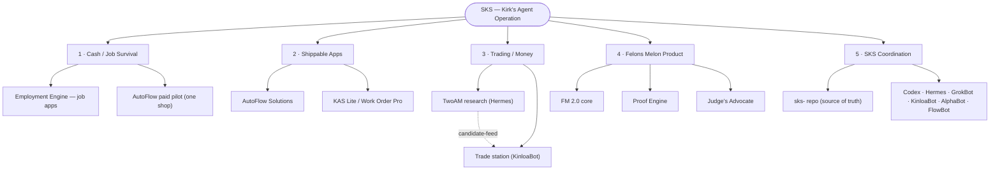

# SKS project map - 2026-08-19

Purpose: master hierarchy of Kirk's agent operation, numbered by money priority. Generated by FlowBot (Hermes `flowbot` skill) from `SKS canonical build index 2026-08-18.md`.

Rendered copies: `SKS project map 2026-08-19.png` (image) and `SKS project map 2026-08-19.pdf` (print/share).

